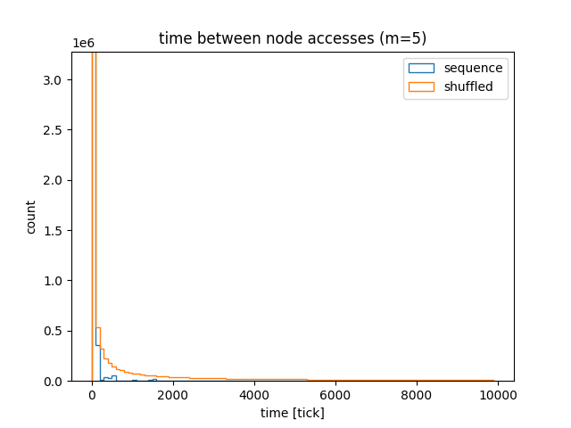
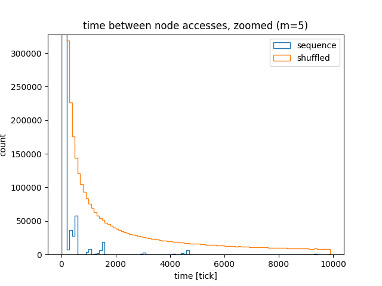

# Comparing performance of sequential and random insertions to a B-tree

I read [this interesting article][ref_art] about choosing primary keys (PK) in Postgres. The article mentions that using UUID as PK causes performance drop w.r.t. to sequential integer PK:

> [...] when you use Postgres native UUID v4 type instead of bigserial table size grows by 25% and insert rate drops to 25% of bigserial.

Back when I worked in Amazon I recall a tech talk that mentioned that using a UUID keys instead of serial keys causes performance drops for databases
that use B-tree, because insertions of UUID to a B-tree are less cache-friendly than inserting serial integers.

I decided to explore the topic further, so I implemented a B-tree and run some benchmarks. I could measure the performance directly (with [Go benchmark][ref_go_bench]), I wanted also to somehow measure "cache friendliness". To measure **cache friendliness**, I checked times when a node of the B-tree was last accessed, where the "time" is just a tick of an integer counter. The intuition behind the measurement is that when a node is accessed more frequently (less "ticks" between the accesses), there is a larger chance that the node is still in cache. The more "ticks" between the subsequent accesses of the mode, the more chance the node was evicted from the cache. The less "ticks" between the accesses of the nodes overall, the structure (or the insert pattern) is more cache-friendly.

[ref_go_bench]: https://pkg.go.dev/testing#hdr-Benchmarks
[ref_btree]: https://en.wikipedia.org/wiki/B-tree#Insertion
[ref_art]: https://shekhargulati.com/2022/07/08/my-notes-on-gitlabs-postgres-schema-design/

# Performance

The [original article][ref_art] mentions inserting UUIDs. My simplistic B-tree implementation does not support UUIDs, just ints, so I compared insertion of an increasing sequence of integers and a shuffled sequence of integers. The assumption here is that the shuffled sequence would emulate how semi-random UUID (or a hash of it) is inserted to the tree.

The table summarises the time it takes to insert 100k keys to B-trees of different B-tree order. The "degradation" is the time it takes to insert the shuffled sequence `t_shuf` compared to time it takes to insert the straight sequence `t_seq`:

```
degradation = (time for shuffled sequence) / (time for straight equence) - 1
```

| btree order | degradation |
| ----------- | ----------- |
| 2           | 156.6%      |
| 3           | 17.5%       |
| 6           | 17.0%       |
| 10          | 20.9%       |
| 23          | 29.0%       |

Apart of the tree of order of 2 (a binary tree), the performance is consistently ~20% worse for insertion of the shuffled sequence. The order of B-tree is the number of child nodes per internal node. [Postgres docs do not say][ref_pg_docs] what is the order of its B-trees, and even if it's constant.

[ref_pg_docs]: https://www.postgresql.org/docs/current/btree-implementation.html#BTREE-STRUCTURE

# Cache friendliness

Looking at node access times should tell how cache friendly is the insert sequence. The less time between accesses of the nodes, the more is the chance that the node still sits in the cache.

Here are the histograms comparing node access times for a straight sequence and a shuffled sequence. What's apparent is that for the shuffled sequence, there is a long tail of accesses with large access times.



Zoomed:



The blue bars on the very left show that most of the nodes were accessed with 2000 "ticks". This means that if only the cache can hold 2000 nodes, the nodes won't be evicted from the cache. On the other hand, the orange line shows that there are many nodes that are accessed infrequently, so, intuitively, the chance of cache eviction is higher.

How many?

For the straight sequence, 96% of the accesses happen within 100 ticks, and 99.9% accesses happen within 2,000 ticks. On the other hand, for the shuffled sequence, 47% accesses happen within 100 ticks, 63% within 2,000 and 83% within 100,000 ticks.

# TODO to check

- TODO Check if there is a "sharp drop" of performance. Check the benchmarks while increasing n from 1000 to 1M, assume 2MB cache will kick
